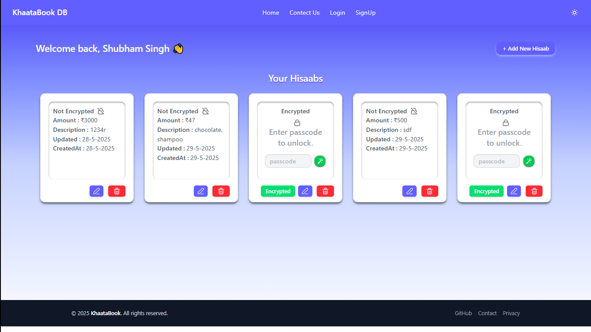

# 📘 KhaataBook Clone – Personal Ledger App

Inspired by the original KhaataBook, this is a full-stack ledger management app built for learning, portfolio, and showcasing real-world backend practices.



## 🚀 Features

- 🧾 Manage multiple "hisaabs" (ledgers)
- 🔐 Optional passcode encryption for sensitive records
- ✅ Triple-layer data validation:
  - Frontend (JavaScript)
  - Backend (Joi in Express routes)
  - Database (MongoDB Schema)
- 🎨 Responsive UI with TailwindCSS
- ✨ Animated splash screen for brand touch

## 🛠️ Tech Stack

- **Backend:** Node.js, Express.js
- **Database:** MongoDB + Mongoose
- **Frontend:** EJS Templates + TailwindCSS
- **Validation:** Joi (backend), custom JS (frontend)
- **Security:** Input validation & clean data handling

## 📁 Project Structure
KhaataBook/  
├── models/ # Mongoose Schemas  
├── public/ # Static assets (CSS, JS, images)  
├── routes/ # Express route handlers  
├── views/ # EJS templates  
├── .env # Environment variables  
├── app.js # Main app entry  
└── package.json  

## 🔧 Setup Instructions

1. **Clone the repo**
   ```bash
   git clone https://github.com/Shubham-404/KhaataBook.git
   cd KhaataBook
   
2. **Install dependencies**
   ```bash
   npm install

3. **Configure environment**
   Create a .env file:
   ```bash
   MONGO_URI=your_mongo_connection_string
   
4. **Run the server**
   ```bash
    npm run dev
   
5. **Open the app**
   ```bash
   http://localhost:3000
